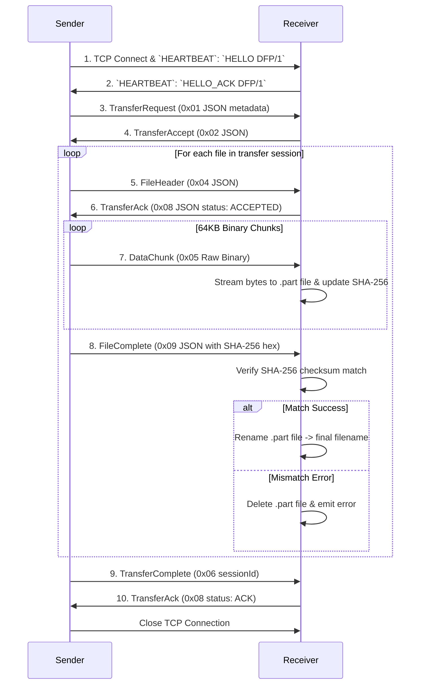

# DropFlow Transfer Protocol Specification (DFP/1)

Version: `1`  
Protocol String: `DFP/1`  
Magic Bytes: `DFP1` (`0x44 0x46 0x50 0x31`)  
Default Port: `42100`  
Multicast Group: `224.0.0.251`  
Service Type: `_dropflow._tcp`  

---

## 1. Overview & Architecture

DropFlow uses a local-first, peer-to-peer binary transfer protocol over TCP with mDNS service discovery (`_dropflow._tcp`). Transfers require zero internet access, cloud accounts, or third-party servers.

### Key Characteristics
- **Binary Header**: Fixed 10-byte global packet header.
- **Raw Binary Streaming**: File contents are streamed as 64KB raw binary chunks (zero Base64 / JSON encoding overhead).
- **Streaming IO**: Memory consumption is bounded to 64KB buffers, supporting 10GB+ files cleanly.
- **SHA-256 Verification**: Integrity is validated per file via SHA-256 digest comparison.
- **Cancellation & Cleanup**: Aborted transfers immediately delete `.part` temporary files and notify peers.

---

## 2. 10-Byte Global Packet Header

Every frame sent over a DropFlow TCP socket starts with a 10-byte header:

```text
 0                   1                   2                   3
 0 1 2 3 4 5 6 7 8 9 0 1 2 3 4 5 6 7 8 9 0 1 2 3 4 5 6 7 8 9 0 1
+-+-+-+-+-+-+-+-+-+-+-+-+-+-+-+-+-+-+-+-+-+-+-+-+-+-+-+-+-+-+-+-+
|       'D'     |       'F'     |       'P'     |       '1'     |  [0..3] Magic Bytes
+-+-+-+-+-+-+-+-+-+-+-+-+-+-+-+-+-+-+-+-+-+-+-+-+-+-+-+-+-+-+-+-+
|  Version (1)  |   Frame Tag   |       Payload Length          |  [4..7] Ver, Tag, Len (BE)
+-+-+-+-+-+-+-+-+-+-+-+-+-+-+-+-+-+-+-+-+-+-+-+-+-+-+-+-+-+-+-+-+
|  Payload Length (cont.)       |       Payload Bytes ...       |  [8..9] Len cont.
+-+-+-+-+-+-+-+-+-+-+-+-+-+-+-+-+-+-+-+-+-+-+-+-+-+-+-+-+-+-+-+-+
```

### Field Definitions
1. **Magic Bytes (4 bytes)**: `0x44 0x46 0x50 0x31` (`"DFP1"`)
2. **Protocol Version (1 byte)**: `0x01` (`DFP/1`)
3. **Frame Tag (1 byte)**: Frame identifier code
4. **Payload Length (4 bytes)**: Big-endian 32-bit unsigned integer specifying payload length in bytes.

---

## 3. Frame Tag Definitions

| Tag Name | Code (Hex) | Payload Type | Description |
| :--- | :--- | :--- | :--- |
| `TRANSFER_REQUEST` | `0x01` | JSON (`TransferMetadata`) | Initiates session with file list metadata |
| `TRANSFER_ACCEPT` | `0x02` | JSON (`TransferAckPayload`) | Recipient accepts transfer request |
| `TRANSFER_REJECT` | `0x03` | JSON (`TransferAckPayload`) | Recipient declines transfer request |
| `FILE_HEADER` | `0x04` | JSON (`FileHeaderPayload`) | Precedes individual file stream |
| `DATA_CHUNK` | `0x05` | Raw Binary Bytes | 64KB raw binary file chunk buffer |
| `TRANSFER_COMPLETE` | `0x06` | Text / JSON (`sessionId`) | Sent when all files in session finish |
| `TRANSFER_CANCEL` | `0x07` | JSON (`sessionId`) | Sent when user cancels transfer |
| `TRANSFER_ACK` | `0x08` | JSON (`TransferAckPayload`) | Acknowledges file header & resume offset |
| `FILE_COMPLETE` | `0x09` | JSON (`FileCompletePayload`) | Contains sender's final SHA-256 checksum |
| `HEARTBEAT` | `0x0A` | Text (`HELLO DFP/1`) | Handshake & keep-alive ping |
| `ERROR` | `0x0B` | Text / JSON | Reports protocol or IO error |

---

## 4. Transfer Sequence & State Machine



---

## 5. Storage Strategy & Checksum Flow

1. **Android Receive Location**:
   Default: `/storage/emulated/0/Download/DropFlow/`
2. **Partial Files**:
   During active streaming, files are saved as `filename.ext.part`.
3. **Collision Handling**:
   If `filename.ext` already exists, receiver generates `filename (1).ext`.
4. **SHA-256 Integrity Verification**:
   - Both sender and receiver compute `MessageDigest.getInstance("SHA-256")` dynamically during streaming.
   - On `FileComplete`, receiver compares its hexadecimal digest with sender's checksum string.
   - If matched: `.part` file is renamed to final destination path.
   - If mismatched: `.part` file is deleted immediately and error `SHA256_MISMATCH` is logged.

---

## 6. Error Handling & Teardown

- **Handshake**: Every connection begins with a `HEARTBEAT` `HELLO DFP/1` / `HELLO_ACK DFP/1` exchange before any transfer frame. Both desktop and Android enforce it.
- **Frame bounds**: Metadata and control frames are limited to 64KB. `DATA_CHUNK` frames are limited to 1MB and must not exceed the remaining bytes declared by the current file header.
- **Completion acknowledgement**: A sender treats a transfer as complete only after the receiver has validated every file, processed `TRANSFER_COMPLETE`, and returned `TRANSFER_ACK` with status `ACK`.
- **Cancellation**: User tapping Cancel sends `FrameTag::Cancel` (`0x07`). Socket streams are closed and incomplete `.part` files are unlinked.
- **Timeouts**: Socket read timeout set to `15,000ms`. Failure to receive frames closes session safely without crashing.
